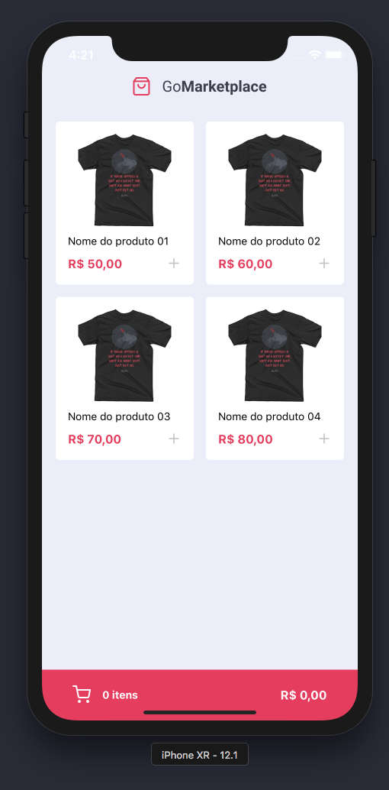
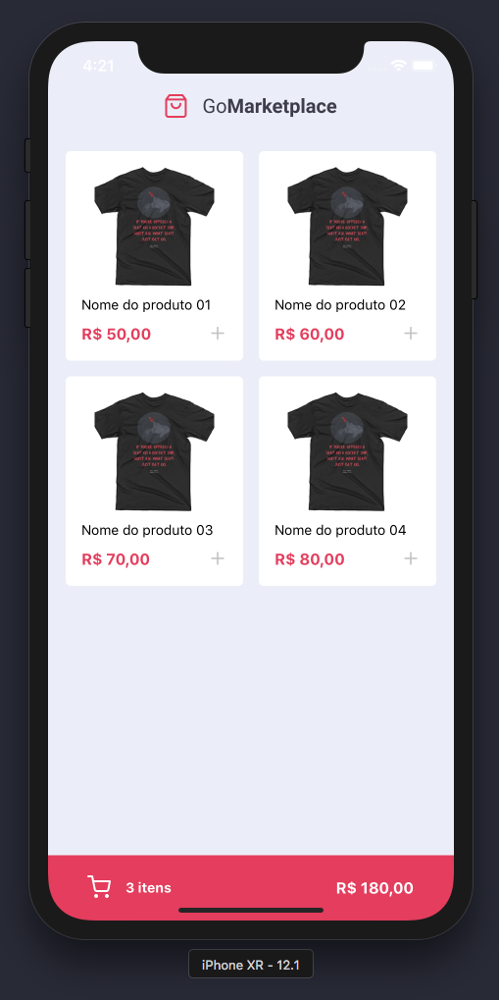
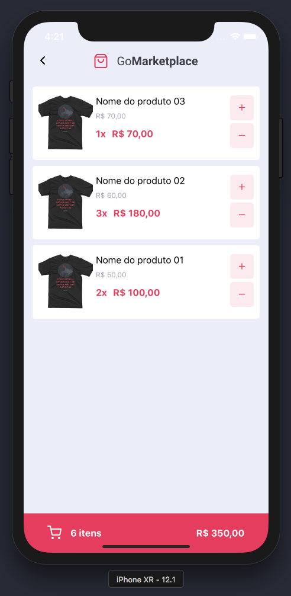

<h3 align="center">
  Desafio 08: Fundamentos do React Native
</h3>

“Desafio proposto no Bootcamp GoStack 2020 Rocketseat”!</blockquote>

## :rocket: Sobre o desafio

Interface Mobile nativa com React Native que lista produtos à venda, ao clicar no produto ele é adicionado ao carrinho, navegando para o carrinho podemos adicionar mais produtos na quantidade ou diminuir, tudo é atualizado em tempo real com o preço final da compra!

## 💅 Layout da aplicação

---

Feito com 💜 Carlos Rodrigues
